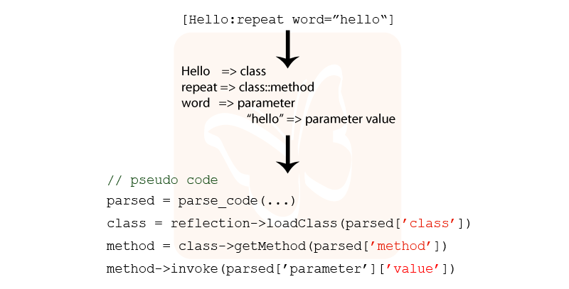

# Plugin Demo

The demo plugin system is not completely polished, but it gives an idea of what is possible. I have created a simple diagram that shows how the system works.

What is missing in the chart is the fact that the system also does some extra validation before loading and executing code. 

The beauty and strength of such a system is that the code is only loaded into memory when it is really needed.